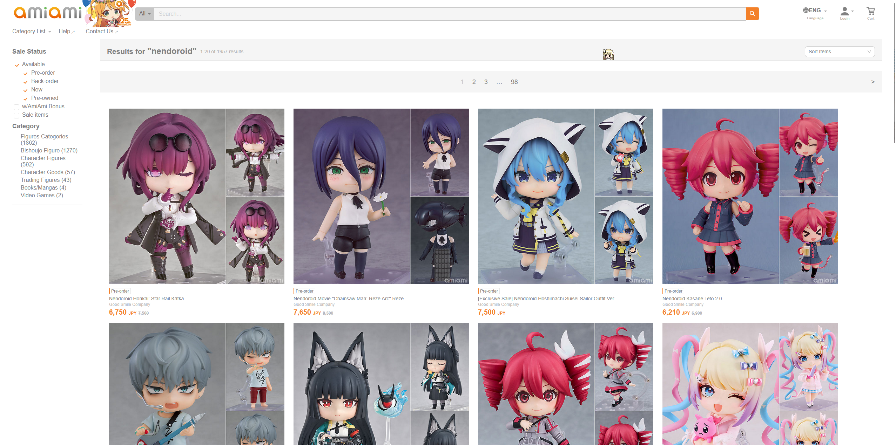

# amiami-layout-improver

This is a super basic TamperMonkey script to improve the layout of AmiAmi's serach results.

The problem: For some reason, even on a 1440p monitor, AmiAmi search results are hard-coded to be a maximum of 150px tall/wide. This makes search results VERY small when browsing on desktop!

The solution: I wrote a super quick TamperMonkey script that just injects a stylesheet with two CSS updates:
- Item width set to 500px
- Item image max height set to 500px

In my opinion, this offers a superior browsing experience on desktop, allowing you to see the details of a given item before you actually click and open it.

## Comparison

Traditional AmiAmi search result size (extension not enabled):

New, modified AmiAmi search result size:

## Installation

If you don't have TamperMonkey yet, get TamperMonkey.

Then, click the "+" button to create a new script, and paste in the contents of this script. Save it, reload AmiAmi, and you're good to go!

## Troubleshooting

**Note:** This script will likely need tuning depending on your desktop resolution, the AmiAmi experience is probably even crazier in 4K. Feel free to play with the 500px value and bump it around as you see fit.

Also, this script is limited to only affect the page `https://www.amiami.com/eng/search/list*`. I didn't want to break any non-search pages with these CSS changes, so it's locked to only affect search results, specifically on the English version of AmiAmi.

If you're using AmiAmi in a different language, you can just swap out that URL with yourt language's search URL. Or heck, you can just swap it with `https://www.amiami.com/*` to make the script work everywhere. I'm not your boss!